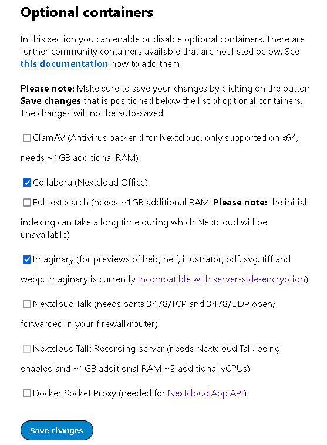
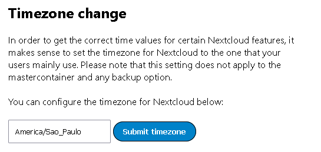
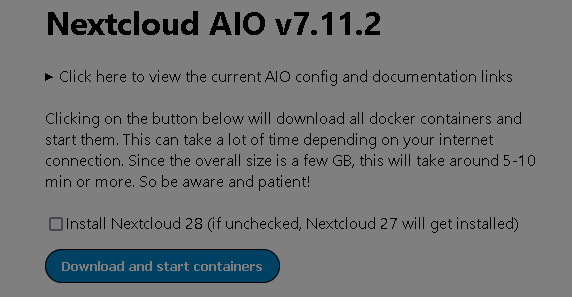

# caddy + tailscale (Full free way of hosting a home server)

* Install [tailscale](https://tailscale.com/download/linux)
  - add pc
  - [choose a dns domain](https://login.tailscale.com/admin/dns)

* Create a funnel https://tailscale.com/kb/1223/funnel

```sh
tailscale funnel 80 &
```

* Create a letsencrypt certificate

https://certbot.eff.org/instructions
* Install Docker

* Install [caddy](https://caddyserver.com/docs/install)

* Create Caddyfile in /etc/caddy

https://caddyserver.com/docs/quick-starts/reverse-proxy#caddyfile

```Caddyfile
:80

reverse_proxy :11000
```

* Move to /etc/caddy and start caddy

```
caddy start &
```

```
curl -fsSL https://get.docker.com | sudo sh
```

* Run Nextcloud AIO

```sh
sudo docker run \
--init \
--sig-proxy=false \
--name nextcloud-aio-mastercontainer \
--restart always \
--publish 8080:8080 \
--env APACHE_PORT=11000 \
--env APACHE_IP_BINDING=0.0.0.0 \
--volume nextcloud_aio_mastercontainer:/mnt/docker-aio-config \
--volume /var/run/docker.sock:/var/run/docker.sock:ro \
nextcloud/all-in-one:latest
```

* Access https://<server_ip>:8080

* Select containers to run



* Set timezone



* Click Download and start containers




## If any connection error occurs check caddy and tailscale and restart each service

### Troubleshoot, check port 80

```sh
ss -atunp | grep :80
```

## To Remove Nextcloud AIO

https://github.com/nextcloud/all-in-one#how-to-properly-reset-the-instance


## Reference

https://github.com/nextcloud/all-in-one/blob/main/reverse-proxy.md#2-use-this-startup-command